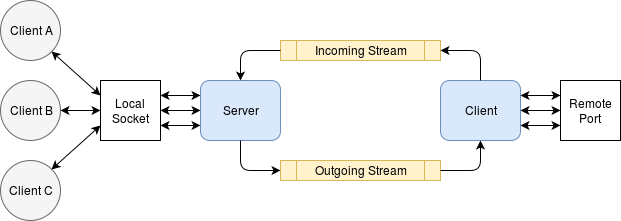
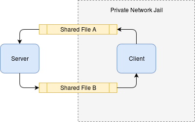
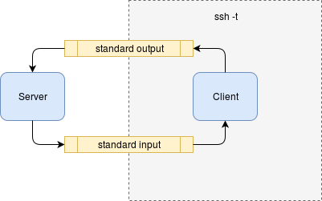

# No PPP socket over stream tunnel

Similarly to other socket over serial device tools the no-ppp implements a tunnel to remote tpc resources. In addition it extends their capacity to work not only character devices but over standard input and output or files. See the general approach diagram below:



In such case the client and server are being synchronized to use the same shared resource for incoming and outgoing tcp messages. The support of multiple users is based on non-blocking packetizing of data from user sockets with further mapping them on their connections on client side.

Such tool could be very useful when the usage of standard network devices is undesirable. See and example below:



In this situation the client machine is jailed by VPN policy in private network without granted access to local network adapters, serial and usb ports.



In the next case the even standard input / output can be useful to establish a connection to remote resource when standard tools such as port mapping or tunnel devices are blocked.

### Technologies:

 * Java
 * Netty
 * Jackson
 * Maven

### How to use:

 * Serial or usb serial device

 Server side:
 ```bash
 $ cat /dev/ttyS0 | java -jar no-ppp.jar -v -s -H 0.0.0.0 -P 3130 > /dev/ttyS1
```
 Client side:
 ```bash
 $ cat /dev/ttyS1 | java -jar no-ppp.jar -v -c -H 2.2.4.2 -P 3128 > /dev/ttyS0
```

 * Shared files

 Server side:
 ```bash
 $ java -jar no-ppp.jar -v -s -i /work/tmp/i -o /work/tmp/o -H 0.0.0.0 -P 3130
```
 Client side:
 ```bash
 $ java -jar no-ppp.jar -v -c -i /work/tmp/o -o /work/tmp/i -H 2.2.4.2 -P 3128
```

Windows clients can operate the cygwin or git-bash interfaces.
